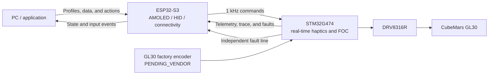

# GL30 Haptic Control

[简体中文](README_CN.md) · [Feature research](docs/feature-research.md) · [Roadmap](ROADMAP.md) · [Contributing](CONTRIBUTING.md) · [Evidence boundary](docs/evidence-boundary.md)

[](https://github.com/Master-1st/GL30-Haptic-Control/actions/workflows/ci.yml)
[](ROADMAP.md)
[](LICENSE)

**This is not a knob with a screen added. It is a knob whose physical feel is programmable.**

The project turns “what a control feels like” from fixed mechanics or hard-coded motor behavior into an application-configurable **Haptic Profile**. The same hardware can behave like a detented knob, a spring-return controller, a soft-limited adjuster, a damped flywheel, or a physical interface that changes with software state.

The CubeMars GL30 force-feedback knob is the first reference device, not the platform boundary. The longer-term target includes CNC, media, CAD, robotics, simulation equipment, and custom control surfaces.

The current product target is **fully wireless force feedback**: a 3S battery serves the motor power domain, one USB-C port provides PD charging and USB 2.0 data, and the enclosure is reduced to `96 × 96 mm`. The front face has no ordinary buttons but retains a recessed lower status/ambient light strip; four function keys move to the left/right sides and a separate power key sits on the rear. Battery capacity and runtime still require measured prototype power data.


> [!IMPORTANT]
> **Current reality:** the no-hardware stack builds, tests, and simulates. The STM32 FOC, haptic primitives, safety path, telemetry, and fault trace exist at code level. The GL30 factory-encoder interface still needs written vendor confirmation, so the real motor is intentionally prevented from producing torque. This repository does not yet claim physical closed-loop or measured haptic performance.

Status shorthand: ✅ available now · 🧩 low-level code exists, hardware pending · 🛠 explicitly planned, not implemented · 🔌 external host/network/service required · ❌ unsupported or not promised.

## Feel is the primary feature

One knob should not be limited to one fixed mechanical feel. As its application or value changes, it can move from smooth free rotation to crisp numerical detents, from a heavy flywheel to a spring that returns to center, or place a tactile landmark at a limit, clip boundary, mute point, or hazard zone.

| Target feel | What the user should feel | Current status |
| --- | --- | --- |
| Smooth free rotation | No fixed mechanical steps, no low-speed stickiness, and no periodic cogging or jumps during a fast flick | 🧩 A zero-haptic-torque path exists; cogging, bearing drag, encoder ripple, and current noise remain unmeasured and uncompensated |
| Adjustable virtual detents | Count, spacing, strength, and snap change with the task instead of every value sharing one mechanical click | 🧩 The STM32 detent primitive exists; clarity, noise, and defaults need a sample |
| Spring return / recentering | Release the knob and it returns to pause, zero, or center for speed, trim, and temporary adjustments | 🧩 Position/spring code exists; active return requires hardware safety validation |
| Soft endstops | Elastic resistance appears after reaching a value limit instead of relying on a display or mechanical collision | 🧩 Out-of-range restoring torque exists; an anticipatory soft-zone curve, feel, and safe peak torque still need implementation/measurement |
| Damping and friction | Fine control stays stable while fast movement remains intentional; the knob can feel viscous, tight, or loaded | 🧩 Both terms exist in code; natural feel and acoustic behavior are unmeasured |
| Inertia / flywheel / momentum | A fast flick traverses a long list or timeline and then settles gradually | 🛠 A low-level inertia term exists; the complete momentum interaction does not |
| Magnetic landmarks | Clip boundaries, preferred values, 0 dB, or integer playback rates feel attracted | 🛠 Profiles describe landmarks; the STM32 runtime does not execute them yet |
| Asymmetric detents and textures | Direction-dependent clicks, warning zones, surface texture, and short tactile cues | 🛠 Schema/protocol fields exist; effect generation and physical validation do not |
| Context-dependent feel | The same hardware changes detents, limits, and feedback with application, page, and state | 🛠 The Profile architecture exists; automatic matching and full deployment do not |

“Smooth, crisp, quiet, and premium” are the most important product goals, but they remain **measurement targets**. Motor cogging, encoder linearity, timing, mechanical eccentricity, and acoustics all affect the outcome; this repository will not claim them before physical measurements and user evaluation.

## Real integrations this can target

Selecting a Haptic Profile is intended to change feel, input behavior, and AMOLED content together. Every row below has a defined implementation path, but none is represented as an installable finished application unless explicitly stated.

| Scenario | Intended experience | Integration path and boundary |
| --- | --- | --- |
| **Volume and media** | Turn for volume, touch/button for mute, soft limits at minimum/maximum, and distinct feels for playback and seeking | 🛠 Global controls can use USB/BLE HID; Windows per-app volume requires PC Companion and OS audio APIs and cannot be done by HID alone |
| **Timer / Pomodoro** | Fast-turn minutes, slow-turn fine adjustment, touch to start/pause, progress on screen, and a bounded tactile completion cue | 🛠 Can become a local offline ESP32 app; UI, persistence, and alerts are not implemented, and optional sound depends on final audio hardware |
| **Home Assistant smart home** | Brightness, color temperature, thermostat, blinds, fan, media volume, and scenes each get meaningful detents and limits | 🔌 Wi-Fi + MQTT/Home Assistant Discovery is the preferred path; it needs the user's HA instance, broker credentials, and entity mapping, and no client exists yet |
| **Weather / air quality** | Show current and hourly forecasts, rotate through time, and place tactile landmarks at rain, freeze, or heat thresholds | 🔌 Open-Meteo is the fixed first demo source; a Home Assistant weather adapter may follow. Wi-Fi, location, and a provider are required; this is not an offline weather station |
| **Video editing / timelines** | Frame detents, clip-boundary attraction, inertial long-timeline navigation, and playback speed that returns to pause and snaps to 1×/2×/4× | 🛠 SmartKnob publicly demonstrated the interaction; GL30 still needs a host integration, momentum logic, and measured tuning |
| **DAW / MIDI / color grading** | Beat or parameter detents, a 0 dB/center landmark, fine/coarse modes, and reusable mappings | 🛠 USB MIDI or a local plugin is practical; neither MIDI nor target-application adapters exist today |
| **CAD / 3D and creative tools** | Zoom, timelines, brushes, parameters, and undo history use different damping, detents, and limits | 🛠 Requires shortcuts, plugins, or Companion adapters per application; no universal protocol can cover every tool |
| **PC / game dashboard** | Show FPS, frame time, CPU/GPU, and device state while controlling volume, pages, or mapped game parameters | 🛠 Profile examples and data fields exist; PresentMon, LibreHardwareMonitor, RTSS, and game adapters do not |
| **CNC / robotics / simulation** | Coarse/fine jog, joint limits, recentering, resistance changes, and state warnings | 🛠 Technically addressable, but it needs a dedicated safety adapter and scenario validation; this is not currently a safety-rated machine control |

These priorities come from public SmartKnob, X-Knob, and SuperDial implementations, demos, and issues—not an invented feature dump. See [feature and community-demand research](docs/feature-research.md) for sources, recurring requests, and scope decisions.

## Explicit non-capabilities and non-claims

| Boundary | Conclusion |
| --- | --- |
| Production-grade feel today | ❌ No. There is no real GL30 closed loop, blind evaluation, acoustic, thermal, or lifetime evidence yet |
| Direct connection to every smart-home device | ❌ Not promised. ESP32-S3 provides 2.4 GHz Wi-Fi and BLE. Matter over Wi-Fi can be evaluated, but direct Zigbee/Thread requires an 802.15.4 radio or an existing gateway |
| Fully offline weather | ❌ Not possible with the current sensor set; forecasts must come from Home Assistant or an external service |
| Arbitrary application control through standard HID alone | ❌ Not possible. Generic media keys can use HID, while per-app volume, editing, CAD, and DAW control need host adapters |
| Replacing a six-degree-of-freedom SpaceMouse | ❌ Not possible with a single rotary axis; zoom and parameter control are feasible, 6-DOF input is not |
| Copying upstream PID, current, or calibration values | ❌ Forbidden. Only haptic intent is converted; GL30 hardware parameters require new calibration and safety clamping |
| Months of battery life | ❌ Not promised. The current 3S wireless architecture and 800 mAh mechanical reference establish packaging only; average power, runtime, cycle life, and safety still require prototype evidence |
| Unattended active rotation or safety-critical alerting | ❌ Not promised. Active motion needs touch detection, fail-safe behavior, speed/torque limits, and physical fault testing |

## Why this approach matters

| Advantage | Practical value | Current basis |
| --- | --- | --- |
| **Dedicated real-time motor core** | AMOLED rendering, BLE/Wi-Fi traffic, and application stalls stay outside the motor-control critical path | STM32G474 independently schedules 40 kHz FOC and 2 kHz haptics; ESP32-S3 owns UI, connectivity, and configuration |
| **Profile-defined physical feel** | Applications compose detents, springs, endstops, damping, friction, and inertia without changing FOC | JSON Schema, example Profiles, the binary command, and six base haptic primitives exist; full runtime mapping remains open |
| **Fail-off safety model** | Lost communication, invalid sensing, overcurrent, or missed control progress cannot keep replaying stale torque | DRVOFF, TIM1 BKIN/MOE gating, startup gates, command timeouts, watchdogs, torque/current/speed limits, and latched faults are implemented and host-tested |
| **Measurable and debuggable** | Tuning is based on current, torque, timing, loss, temperature, and pre-fault data—not only subjective feel | 2 kHz fast telemetry, slower power/thermal telemetry, a 4096 × 6 frozen fault trace, and deterministic protocol vectors exist |
| **Designed for reproduction** | Other developers can inspect, repeat, challenge, and improve the engineering rather than only watch a demo | CubeMX/Keil project, protocol, simulator, tests, BOM, PCB drawing guide, parametric CAD, and evidence policy are public |

These are design and engineering advantages, not completed performance claims. Torque quality, noise, thermal behavior, lifetime, and usable bandwidth require physical measurements.

## Reusing earlier force-feedback configurations

**Compatibility targets are limited to force-feedback knobs with public haptic configuration formats or structured presets.** The project should not force the community to recreate existing haptic presets, and it must not import motor-specific calibration, PID, or current values into GL30.

| Source | Current conclusion | Practical meaning |
| --- | --- | --- |
| GL30 AMOLED V6 `profileVersion: 1` | ✅ **Native format compatibility** | The V6 and current Schemas differ only in identifiers; both V6 examples pass unchanged, 2/2 in the present audit; inconsistent or out-of-range input is still rejected by stricter semantic/safety rules |
| SmartKnob `SmartKnobConfig` | 🛠 **Converter planned** | Detent width, endstops, snap point, and magnetic positions are mappable; Protobuf, normalized strengths, and runtime state are not direct copies |
| X-Knob `XKnobConfig` | 🛠 **Preset converter planned** | X-Knob is a force-feedback knob; position count/width, detent/endstop strength, and snap point are mappable, but presets are C++ structures and a static array that require safe extraction |

Compatibility belongs in PC Companion: `legacy haptic configuration → adapter → Canonical Profile → validation/clamping/report → device command`. The STM32 real-time core keeps one deterministic binary interface and does not parse JSON/Protobuf or accumulate legacy protocol stacks.

Non-haptic application I/O protocols, automation interfaces, and UI-only formats are outside this compatibility matrix. Projects without a public haptic configuration structure do not occupy adapter targets. See the [force-feedback configuration compatibility plan](docs/profile-compatibility.md) for mappings, rejected hardware data, pinned upstream commits, and intentionally blank future-adapter slots. **Only V6 Profile objects have native format compatibility today; SmartKnob and X-Knob converters do not yet exist.**

## How the system works



| Real-time task | Firmware schedule | Purpose |
| --- | ---: | --- |
| Current loop / FOC | 40 kHz | Current sampling, transforms, PI control, and SVPWM |
| Encoder / observer | 4 kHz | Angle, velocity, and acceleration estimation |
| Haptic runtime | 2 kHz | Convert Profile/command state into target torque |
| Fast telemetry | 2 kHz | Angle, current, torque, state, and timing |
| Application command | 1 kHz | Receive haptic parameters and control requests |
| Safety monitor | 200 Hz | Power, thermal, communication, and latched-fault supervision |

These are code scheduling values, not measured mechanical closed-loop bandwidth.

## Capability status

Status vocabulary:

- ✅ **Available now:** runnable or inspectable without physical hardware;
- 🧩 **Implemented in code:** present in STM32/PC code and automated tests, but requires physical validation and tuning;
- 🛠 **Planned:** explicitly on the roadmap but not usable today;
- 🔌 **External dependency:** requires host software, network, service, gateway, or target application work;
- ❌ **Unsupported/not promised:** current hardware or evidence is insufficient and it must not be marketed as a capability;
- ⏳ **Pending:** blocked on vendor data, sample measurements, or design evidence.

### ✅ Available now without hardware

| Capability | What works now | Evidence limit |
| --- | --- | --- |
| STM32 project | Regenerate the MDK-ARM project with STM32CubeMX and build the active LL path | `BUILD_ONLY`; it does not prove motor motion |
| Protocol and PC core | Encode/decode V1 binary frames, CRC32C, stream resynchronization, command clamping, time sync, and trace downsampling | TypeScript tests and deterministic golden vectors |
| Haptic Profile | Validate JSON Profiles and inspect game-dashboard and video-timeline examples | Schema works; the physical-device pipeline does not yet |
| Device simulator | Exercise commands, telemetry, communication timeouts, safety states, and the no-hardware end-to-end data path | `SIM_ONLY`; it does not model real motor mechanics or feel |
| Firmware algorithm regression | Host-test protocol, driver logic, FOC mathematics, haptics, safety supervision, and fault trace | Software regression only; no peripheral or power-stage evidence |
| Digital hardware package | Inspect the `96 × 96 mm` wireless concept CAD, four side keys/rear power key, 3S battery keep-out, bench-board BOM, PartsBridge/Altium data, PCB guide, and bring-up procedure | `CAD_CHECKED` / design material; no manufactured battery or assembly evidence |

### 🧩 Implemented in code, awaiting hardware validation

| Capability | Current implementation | What physical work must prove |
| --- | --- | --- |
| Three-phase FOC | Clarke/Park, d/q PI control, anti-windup, SVPWM, sampling-window enforcement, and torque estimation | Phase order, current polarity/scaling, dead time, bus ripple, electrical zero, and stability |
| Base haptic primitives | Detent, position/spring, velocity/damper, soft endstop, friction, and inertia, composable at the low level | Real torque, noise, vibration, feel, parameter range, and instability boundaries |
| Motor safety path | Hardware BKIN, DRVOFF, MOE gate, startup checks, communication timeouts, IWDG, overcurrent/thermal/bus faults, and latching | Fault injection, shutdown delay, nuisance trips, recovery, and full-envelope safety |
| Driver and sensing | DRV8316R SPI/CSA framework, synchronized three-phase ADC, current-zero calibration, VBUS, and motor-temperature input | SPI waveforms, CSA gain/matrix, ADC noise, comparator threshold, phase-node overshoot, and temperature |
| Telemetry and fault trace | Fast/slow telemetry, error/drop/deadline counters, and a 40 kHz six-channel RAM trace frozen on fault | Sustained throughput, timestamps, pre-fault data integrity, and PC visualization |
| Auxiliary sensing | INA228 power/energy and VEML7700 ambient-light drivers, retries, and telemetry interfaces | Addresses, calibration, noise, layout effects, and actual product usefulness |

### 🛠 Planned user-facing capabilities

1. **Close the real motor loop:** implement the confirmed encoder backend, then calibrate phase order, current sensing, electrical zero, and low-torque operation.
2. **Complete the Profile pipeline:** `JSON Profile → PC/ESP32 → binary command → STM32 haptic runtime`, so changing applications changes physical feel.
3. **Expand haptic effects:** texture, asymmetric detents, marker attraction, composed effects, robust recentering, and a safety-limited active-position mode.
4. **Build the ESP32-S3 application:** 5 Mbaud motor-core transport, log record/replay, AMOLED UI, Profile selection, and engineering status pages.
5. **Deliver the first experience apps:** USB/BLE HID global volume/media, a local timer, Home Assistant/MQTT light control, and a weather card with source and stale/offline state.
6. **Expose creator and host interfaces:** MIDI, video timeline, Windows per-app volume, WebSocket/local plugins, plus device connection and fault-trace tooling.
7. **Complete Profile tooling:** edit, preview, clamp report, deploy, share, and SmartKnob/X-Knob haptic-configuration converters.
8. **Release a reproducible device:** final PCB, mechanics, harnesses, assembly, calibration, thermal/regeneration design, lifetime evidence, and external reproductions.

### ⏳ Decisions and evidence still pending

| Pending item | Why it cannot be frozen yet | What it affects |
| --- | --- | --- |
| GL30 factory encoder part, supply, logic levels, protocol, pinout, connector, update rate, and latency | Public information is insufficient; written vendor data and real waveforms are required | Encoder driver, MCU pins, connector, and first-board schematic |
| Whether the factory unit is specifically AS5048A and which output it exposes | A verbal part name is not a factory SKU, datasheet, and harness definition | Only one real SPI/PWM/ABI path should be frozen; guessed parallel backends will not be retained |
| GL30 phase parameters, torque constant, current envelope, thermal resistance, and regenerated energy | Current numbers are first-pass design inputs; unit and operating-condition variation matters | Current-loop tuning, torque caps, cooling, bus protection, and power supply |
| Final PCB size, copper, cooling, and cost | Bench-board power, thermal, and EMI results must come first | Layout, layer count, BOM, and enclosure volume |
| Mechanical tolerances, support/load path, cable routing, and mounting | Vendor tolerances plus physical assembly and load tests are required | Final CAD, rotating clearance, lifetime, and assembly yield |
| Usable haptic parameters and performance metrics | “Clear,” “quiet,” and “comfortable” need sample measurements and user evaluation | Default Profiles, tuning limits, performance documentation, and release claims |
| EMC, reliability, and safety level | These can only be tested on hardware close to the final design | Whether the platform can become a specific product or pursue certification |

If the confirmed factory interface matches current assumptions, first-board work should mostly be calibration and validation. If its electrical interface or protocol differs, the encoder driver and schematic must change first; that cannot honestly be described as “tuning only.”

## What a Haptic Profile looks like

A Profile describes the physical behavior an application wants. This fragment means “one sinusoidal detent every 15 degrees, with a small amount of damping, friction, and inertia”:

```json
{
  "haptic": {
    "mode": "detent",
    "detent": {
      "widthDeg": 15,
      "strengthmNm": 12,
      "waveform": "sine"
    },
    "damping": 0.00035,
    "friction": 0.001,
    "inertia": 0.00003
  }
}
```

The Schema and examples validate today, and the STM32 contains matching base primitives. Application matching, complete Profile translation, ESP32 delivery, and measured physical behavior remain unfinished.

## Repository map

```text
firmware-stm32/   STM32G474 motor core, CubeMX/Keil project, and host tests
firmware-esp32/   ESP32-S3 application-layer boundaries (application incomplete)
protocol/         Frame format, payload specification, and TypeScript codec
pc-companion/     Profile API, device simulator, and desktop-side core packages
hardware/         Bench-board BOM/guides and parameterized concept CAD
docs/             Architecture, pinout, bring-up, test gates, and evidence limits
scripts/          Deterministic vector generation and no-hardware verification
tests/            TypeScript protocol, Profile, and system tests
```

The public repository keeps the latest snapshot only. Historical design folders, generated build trees, local logs, and redistributable copies of vendor attachments are intentionally excluded.

## Run the no-hardware checks

Requirements: Node.js 24+, pnpm 11.19+, CMake 3.22+, and a C11 compiler.

```bash
pnpm install --frozen-lockfile
pnpm verify

cmake -S firmware-stm32/tests -B build/stm32-host -DCMAKE_BUILD_TYPE=Debug
cmake --build build/stm32-host --config Debug
ctest --test-dir build/stm32-host -C Debug --output-on-failure
```

The only active STM32 project is:

```text
firmware-stm32/cubemx/GL30_AMOLED_V7/MDK-ARM/GL30_AMOLED_V7.uvprojx
```

It is generated by STM32CubeMX and uses LL in the active peripheral path. Regenerate with `firmware-stm32/cubemx/generate.ps1`; see [the motor-core guide](firmware-stm32/README.md).

> [!CAUTION]
> Until the factory encoder interface is confirmed, the `PENDING_VENDOR` backend intentionally refuses motor arming and keeps DRVOFF/TIM1 MOE disabled. Do not bypass `control_ready()` or any hardware safety gate.

## Roadmap and participation

The project is aiming toward a reproducible v1.0 over roughly 12 months, with August 2027 as a target rather than a promise. Vendor closure, electrical validation, motor evidence, thermal/lifetime work, and external reproductions must close before the project calls itself complete. See [ROADMAP.md](ROADMAP.md) for the evidence gates.

This is both an engineering project and a public learning process. Contributions are welcome in safety and schematic review, haptic algorithms and Profiles, STM32/ESP32 code, tests and tools, mechanical tolerances, documentation, and reproduction. Start with [CONTRIBUTING.md](CONTRIBUTING.md), or open a [Discussion](https://github.com/Master-1st/GL30-Haptic-Control/discussions).

## License and third-party material

Original project material is licensed under [Apache License 2.0](LICENSE), unless a file says otherwise. STM32Cube-generated dependencies and other third-party components retain their own notices; see [THIRD_PARTY_NOTICES.md](THIRD_PARTY_NOTICES.md). Vendor STEP/PDF files are not redistributed here—download them from the sources listed in `hardware/cad/vendor/SOURCE_MANIFEST.md`.

This independent community project is not affiliated with or endorsed by CubeMars, STMicroelectronics, Texas Instruments, Espressif, Waveshare, Arm, or Keil. Product names and trademarks belong to their respective owners.
