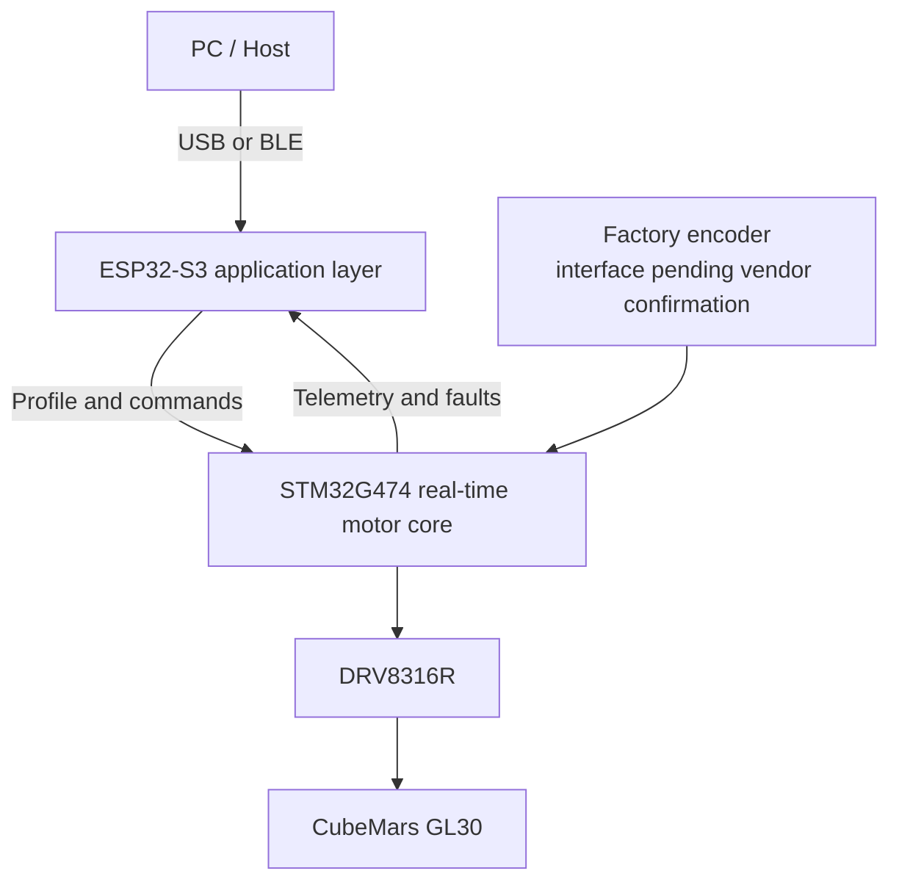

# GL30 Haptic Control

[简体中文](README_CN.md) · [Roadmap](ROADMAP.md) · [Contributing](CONTRIBUTING.md) · [Safety boundary](docs/evidence-boundary.md)

[](https://github.com/Master-1st/GL30-Haptic-Control/actions/workflows/ci.yml)
[](ROADMAP.md)
[](LICENSE)

**An open-source, real-time haptic control platform for software-defined physical interfaces. The force-feedback knob is its first form, not its final boundary.**


> [!IMPORTANT]
> This repository is in active pre-alpha development. The current goal is a reproducible v1.0 reference design within roughly 12 months, targeting August 2027. That date is a direction, not a promise: vendor interface closure, electrical validation, motor testing, thermal results, and external reproduction determine readiness. Guidance, review, experiments, documentation, and learning contributions are warmly welcome.

## Why this project exists

Many haptic knobs combine user interface, connectivity, and motor control on one processor. GL30 Haptic Control deliberately separates them:

- **STM32G474 motor core:** deterministic FOC, haptic runtime, calibration, telemetry, and safety;
- **ESP32-S3 application layer:** AMOLED UI, HID, connectivity, configuration, and audio;
- **Haptic Profile API:** software-defined effects that applications can compose without rewriting FOC code;
- **Reproducible hardware:** open schematics, BOM, CAD, assembly, calibration, and test evidence as each item is validated.



The design target keeps UI stalls, wireless traffic, and application failures outside the 40 kHz motor-control path.

## Current target

| Layer | Current reference | Status |
| --- | --- | --- |
| Motor | CubeMars GL30 KV290, factory-encoder variant | Mechanical envelope checked; encoder interface pending written vendor confirmation |
| Gate driver | DRV8316R | Driver and safety framework implemented; product hardware not tested |
| Motor MCU | STM32G474CET6 | CubeMX-generated MDK-ARM project, LL-based active path |
| Application MCU | ESP32-S3 | Architecture and module boundaries present; application implementation is early |
| Display | 1.32-inch 466 × 466 AMOLED module | CAD envelope and integration baseline only |
| Haptic runtime | Detent, position/spring, velocity/damper, endstop, friction and inertia | Current primitives have host-side coverage; texture, asymmetric detent and the final composite Profile runtime remain planned |

## What is actually verified

The repository separates evidence from plans:

- the STM32 project can be regenerated with STM32CubeMX and built with Keil MDK-ARM/ARMCLANG;
- host-side C tests cover protocol, drivers, FOC mathematics, haptics, safety, and trace logic;
- TypeScript checks, protocol vectors, simulator tests, and no-hardware end-to-end checks run in CI;
- current CAD renders pass the documented digital-envelope assertions.

These are **BUILD_ONLY / SIM_ONLY / CAD_CHECKED** results. They are not evidence of a working product PCB, verified encoder protocol, closed-loop motor control, force quality, temperature, lifetime, EMC, or safety certification.

## Repository map

```text
firmware-stm32/   STM32G474 motor core, CubeMX/Keil project and host tests
firmware-esp32/   ESP32-S3 application-layer modules
protocol/         Framing, payload specification and reference TypeScript codec
pc-companion/     Profile API, device simulator and desktop-side core packages
hardware/         Bench-board BOM/guides and parameterized concept CAD
docs/             Architecture, pinout, bring-up, test gates and evidence limits
scripts/          Deterministic vector generation and no-hardware verification
tests/            TypeScript protocol/profile/system tests
```

Only the latest public snapshot is maintained. Historical design folders, generated build trees, local logs, and redistributable copies of vendor documents are intentionally excluded.

## Start here

### Software-only verification

Requirements: Node.js 24+, pnpm 11.19+, CMake 3.22+, and a C11 compiler.

```bash
pnpm install --frozen-lockfile
pnpm verify

cmake -S firmware-stm32/tests -B build/stm32-host -DCMAKE_BUILD_TYPE=Debug
cmake --build build/stm32-host --config Debug
ctest --test-dir build/stm32-host -C Debug --output-on-failure
```

### STM32 project

The only active STM32 target is:

```text
firmware-stm32/cubemx/GL30_AMOLED_V7/MDK-ARM/GL30_AMOLED_V7.uvprojx
```

Regenerate it with `firmware-stm32/cubemx/generate.ps1`; see [the motor-core guide](firmware-stm32/README.md). The project uses STM32 LL in the active peripheral path.

> [!CAUTION]
> Until the factory encoder interface is confirmed, the `PENDING_VENDOR` backend intentionally refuses motor arming and keeps DRVOFF/TIM1 MOE disabled. Do not bypass `control_ready()` or any hardware safety gate.

## Road to v1.0

The one-year plan is organized by evidence gates rather than feature count:

1. close the vendor encoder and mechanical interface;
2. validate the isolated DRV8316R bench board and fault path;
3. commission current sensing, FOC, calibration, and safe torque mode;
4. implement and measure the composable Haptic Profile runtime;
5. integrate UI/connectivity without compromising the motor core;
6. publish reproducible PCB, mechanical files, calibration data, and build guides;
7. complete external reproductions before calling the design v1.0.

See [ROADMAP.md](ROADMAP.md) for gates and release criteria.

## Join the project

This is both an engineering project and a public learning process. You do not need to own the final hardware to help. Useful contributions include:

- safety and schematic review;
- haptic algorithms and profile examples;
- host-side tests, simulation, and tooling;
- STM32/ESP32 code review;
- mechanical tolerance and load-path analysis;
- documentation, translation, and reproducibility feedback.

Please start with [CONTRIBUTING.md](CONTRIBUTING.md), open a [Discussion](https://github.com/Master-1st/GL30-Haptic-Control/discussions) for design questions, or use an issue template for a checkable task. Critical review is welcome; claims must stay within the available evidence.

## License and third-party material

Original project material is licensed under [Apache License 2.0](LICENSE), unless a file says otherwise. STM32Cube-generated dependencies and other third-party components retain their own notices; see [THIRD_PARTY_NOTICES.md](THIRD_PARTY_NOTICES.md). Vendor STEP/PDF files are not redistributed here—download them from the original sources listed in `hardware/cad/vendor/SOURCE_MANIFEST.md`.

This independent community project is not affiliated with or endorsed by CubeMars, STMicroelectronics, Texas Instruments, Espressif, Waveshare, Arm, or Keil. Product names and trademarks belong to their respective owners.
