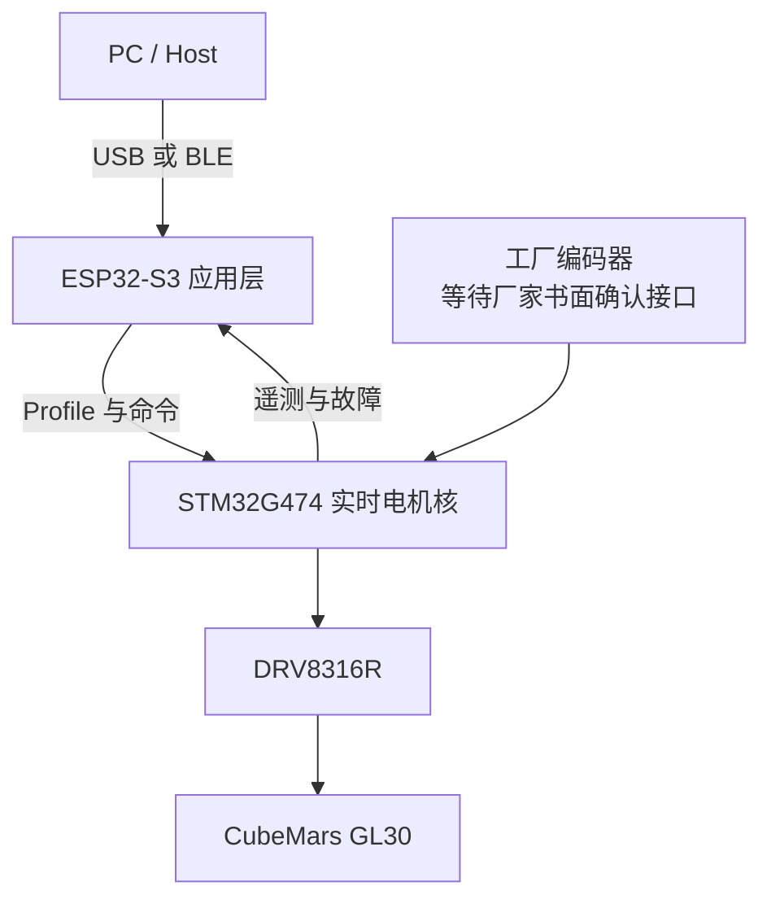

# GL30 Haptic Control

[English](README.md) · [路线图](ROADMAP.md) · [贡献指南](CONTRIBUTING.md) · [证据边界](docs/evidence-boundary.md)

[](https://github.com/Master-1st/GL30-Haptic-Control/actions/workflows/ci.yml)
[](ROADMAP.md)
[](LICENSE)

**面向软件定义物理交互的开源实时触觉控制平台。力反馈旋钮是它的第一种形态，不是最终边界。**


> [!IMPORTANT]
> 本仓库目前处于持续更新的 pre-alpha 阶段。当前目标是在约 12 个月内形成可复现的 v1.0 参考设计，目标时间为 2027 年 8 月。这个时间是方向而不是承诺；厂家接口闭合、电气验证、电机实测、温升结果和外部复现共同决定是否真正完成。欢迎大家指导、审查、实验、补文档，也欢迎和我一起边做边学。

## 为什么做这个项目

很多力反馈旋钮把 UI、无线通信和电机控制放在同一颗处理器里。本项目有意把它们分开：

- **STM32G474 电机核：** 确定性 FOC、触觉运行时、校准、遥测和安全；
- **ESP32-S3 应用层：** AMOLED UI、HID、通信、配置和音频；
- **Haptic Profile API：** 应用不用改 FOC 代码，也能组合软件定义触觉；
- **可复现硬件：** 原理图、BOM、CAD、装配、校准和测试证据在验证后逐步开放。



设计目标是：UI 卡顿、无线流量甚至应用层异常，都不能进入 40 kHz 电机控制关键路径。

## 当前参考架构

| 层级 | 当前方案 | 状态 |
| --- | --- | --- |
| 电机 | CubeMars GL30 KV290 工厂编码器版 | 已核对数字包络；编码器接口等待厂家书面确认 |
| 栅极驱动 | DRV8316R | 驱动和安全框架已实现；产品硬件未实测 |
| 电机 MCU | STM32G474CET6 | CubeMX 生成 MDK-ARM 工程，活动路径使用 LL |
| 应用 MCU | ESP32-S3 | 架构和模块边界已建，应用实现仍处早期 |
| 显示 | 1.32 英寸 466 × 466 AMOLED 模块 | 只有 CAD 包络和集成基线 |
| 触觉运行时 | 档位、位置/弹簧、速度/阻尼、限位、摩擦和惯量 | 当前原语有主机侧覆盖；纹理、非对称档位和最终组合 Profile 运行时仍是计划项 |

## 哪些是真的完成了

仓库把证据和计划分开：

- STM32 工程可由 STM32CubeMX 重新生成，并用 Keil MDK-ARM/ARMCLANG 构建；
- 主机 C 测试覆盖协议、驱动、FOC 数学、触觉、安全和 trace；
- TypeScript 类型检查、协议向量、模拟器测试和无实物端到端检查进入 CI；
- 当前 CAD 渲染通过已写明的数字包络断言。

这些只能叫 **BUILD_ONLY / SIM_ONLY / CAD_CHECKED**。它们不等于产品 PCB 已工作，也不证明编码器协议、闭环电机、触感、温升、寿命、EMC 或安全认证已经验证。

## 仓库结构

```text
firmware-stm32/   STM32G474 电机核、CubeMX/Keil 工程和主机测试
firmware-esp32/   ESP32-S3 应用层模块
protocol/         帧格式、载荷规范和 TypeScript 参考编解码
pc-companion/     Profile API、设备模拟器和桌面侧核心包
hardware/         验证子板 BOM/指南和参数化概念 CAD
docs/             架构、引脚、上电、测试门和证据边界
scripts/          确定性向量生成和无实物验证
tests/            TypeScript 协议/Profile/系统测试
```

公开仓库只维护最新快照，不放历史设计目录、构建目录、本机日志和供应商原始附件副本。

## 先跑无实物验证

需要 Node.js 24+、pnpm 11.19+、CMake 3.22+ 和 C11 编译器。

```bash
pnpm install --frozen-lockfile
pnpm verify

cmake -S firmware-stm32/tests -B build/stm32-host -DCMAKE_BUILD_TYPE=Debug
cmake --build build/stm32-host --config Debug
ctest --test-dir build/stm32-host -C Debug --output-on-failure
```

唯一活动 STM32 工程是：

```text
firmware-stm32/cubemx/GL30_AMOLED_V7/MDK-ARM/GL30_AMOLED_V7.uvprojx
```

用 `firmware-stm32/cubemx/generate.ps1` 重新生成，细节见 [电机核说明](firmware-stm32/README.md)。

> [!CAUTION]
> 工厂编码器接口闭合前，`PENDING_VENDOR` 后端会主动拒绝电机 arm，并保持 DRVOFF/TIM1 MOE 关闭。不要绕过 `control_ready()` 或任何硬件安全门。

## 一年路线

一年计划按证据门推进，不按功能数量堆砌：

1. 闭合厂家编码器和机械接口；
2. 验证独立 DRV8316R 子板与故障链；
3. 完成电流采样、FOC、校准和安全力矩模式；
4. 实现并测量可组合 Haptic Profile 运行时；
5. 集成 UI/通信，同时不破坏电机实时核；
6. 发布可复现 PCB、机械文件、校准数据和装配指南；
7. 有外部复现后再把设计称为 v1.0。

完整门槛见 [ROADMAP.md](ROADMAP.md)。

## 欢迎一起指导和学习

这是一个工程项目，也是公开的学习过程。即使没有整机硬件，也可以参与：

- 安全和原理图审查；
- 触觉算法与 Profile 示例；
- 主机测试、仿真和工具；
- STM32/ESP32 代码审查；
- 机械公差与载荷路径分析；
- 文档、翻译和复现反馈。

请先阅读 [CONTRIBUTING.md](CONTRIBUTING.md)。设计讨论请进 [Discussions](https://github.com/Master-1st/GL30-Haptic-Control/discussions)，可验收的任务请使用 Issue 模板。欢迎严格批评，但所有结论都必须服从真实证据。

## 许可证与第三方材料

未单独说明的原创内容采用 [Apache License 2.0](LICENSE)。STM32Cube 生成依赖及其他第三方组件保留原许可证，见 [THIRD_PARTY_NOTICES.md](THIRD_PARTY_NOTICES.md)。供应商 STEP/PDF 不在仓库内重复分发，请按 `hardware/cad/vendor/SOURCE_MANIFEST.md` 从原始来源下载。

本项目为独立社区项目，与 CubeMars、STMicroelectronics、Texas Instruments、Espressif、Waveshare、Arm 或 Keil 不存在隶属或官方背书关系。产品名和商标归各自权利人所有。
