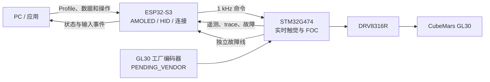

# GL30 Haptic Control

[English](README.md) · [功能与社区需求](docs/feature-research-cn.md) · [路线图](ROADMAP.md) · [贡献指南](CONTRIBUTING.md) · [证据边界](docs/evidence-boundary.md)

[](https://github.com/Master-1st/GL30-Haptic-Control/actions/workflows/ci.yml)
[](ROADMAP.md)
[](LICENSE)

**不是给旋钮加一块屏，而是让旋钮本身变成可以编程的物理界面。**

它要把“旋钮拧起来是什么感觉”从固定机械结构或写死的电机代码，变成应用可以配置的 **Haptic Profile**：同一套硬件可以表现为有刻度的旋钮、带回弹的控制器、有软限位的调节器、带阻尼的飞轮，或随软件状态变化的触觉界面。

CubeMars GL30 力反馈旋钮是首个参考设备，但平台面向的不只是旋钮，而是 CNC、音视频、CAD、机器人、仿真设备和自定义控制台等软件定义物理接口。


> [!IMPORTANT]
> **当前真实状态：** 无实物部分已经可以构建、测试和仿真；STM32 中的 FOC、触觉原语、安全链、遥测和故障追踪已经实现到代码层。由于 GL30 工厂编码器接口仍待厂家书面确认，真实电机目前被安全门主动禁止上力，因此尚不能宣称已经实现实物闭环或真实触感。

状态简写：✅ 现在可用 · 🧩 低层代码已有但待实物 · 🛠 明确计划但尚未实现 · 🔌 依赖外部主机/网络/服务 · ❌ 当前不支持或不承诺。

## 手感才是主功能

同一个旋钮不应该永远只有一种机械手感。切换应用或数值后，它可以从无刻度的顺滑旋转变成清晰的数字档位，从越转越沉的飞轮变成自动回中的弹簧，也可以在上限、关键帧、静音点或危险区给出不看屏幕也能理解的触觉提示。

| 目标手感 | 用户实际感受到什么 | 当前状态 |
| --- | --- | --- |
| 顺滑自由旋转 | 没有机械刻度感，慢速精调不发涩，快速拨动不出现周期性齿槽和突跳 | 🧩 零触觉力矩路径存在；齿槽、轴承阻力、编码器纹波与电流噪声尚未测量或补偿 |
| 可调虚拟档位 | 档位数量、间距、力度和吸附感随任务改变；音量、温度和参数不再共用一种手感 | 🧩 档位原语已进入 STM32；真实清晰度、噪声和默认参数待样机 |
| 弹簧回中 / 回弹 | 松手回到暂停、零位或中点，适合播放速度、配平和临时调节 | 🧩 位置/弹簧原语已有代码；主动回中必须先通过实物安全验证 |
| 软限位 | 到达最小值或最大值后出现弹性阻力，而不是撞上机械限位或盯着数字 | 🧩 越界恢复力已有代码；提前变硬的软区曲线、边界手感和最大力矩仍待实现/测量 |
| 阻尼与摩擦 | 精调时稳、快转时不飘，可模拟紧涩、黏滞或带负载的旋钮 | 🧩 阻尼与摩擦项已有代码；是否自然、安静尚未实测 |
| 惯性 / 飞轮 / 动量滚动 | 快拨可跨越长列表或时间轴，轻触后逐渐停下 | 🛠 已有惯量参数和低层项；完整的动量状态机与交互尚未实现 |
| 磁性标记点 | 关键帧、常用值、0 dB、整数倍率等位置像被“吸住” | 🛠 Profile 已能描述标记点；STM32 运行时尚未执行 |
| 非对称档位与纹理 | 正反方向不同、越界警告、表面纹理或短促触觉提示 | 🛠 Schema/协议预留完成；效果生成与实物验证未完成 |
| 随上下文改变手感 | 同一只旋钮在不同应用、页面和状态下自动换挡、换限位、换反馈 | 🛠 Profile 架构已建立；自动识别与完整下发链路尚未打通 |

“顺滑、清脆、安静、有高级感”是本项目最重要的产品指标，但现在只能作为**待测目标**。电机齿槽、编码器线性、控制时序、结构偏心和声学都会影响结果；没有实物盲测和测量前不会把它写成已实现性能。

## 它能接入哪些真实场景

应用选择一个 Haptic Profile，设备将一起改变触感、输入行为和 AMOLED 内容。下表中的功能都具有明确实现路径，但除标注的底层能力外，当前还不是可直接安装使用的成品应用。

| 场景 | 计划中的实际体验 | 接入方式与边界 |
| --- | --- | --- |
| **音量与媒体** | 转动调音量，触摸/按键静音，最小/最大值有软限位；播放、暂停、切歌和进度定位使用不同档位 | 🛠 全局音量可走 USB/BLE HID；Windows 分应用音量必须由 PC Companion 调用系统音频接口，单靠 HID 做不到 |
| **定时器 / 番茄钟** | 快转设分钟、慢转精调，触摸开始/暂停；运行中显示进度，到时给出受限触觉提示 | 🛠 可作为 ESP32 本地应用离线运行；UI、持久化和提示效果尚未实现，可选声音还取决于最终音频硬件 |
| **Home Assistant 智能家居** | 灯光亮度、色温、恒温器、窗帘、风扇、媒体音量和场景各有对应的档位与边界 | 🔌 优先采用 Wi-Fi + MQTT/Home Assistant Discovery；需要用户自己的 HA、Broker 凭据和实体映射，当前尚无客户端代码 |
| **天气 / 空气质量** | 显示当前与逐小时预报，旋转浏览时段；降雨、结冰或高温阈值可用触觉标记 | 🔌 首个演示源定为 Open-Meteo，后续可做 Home Assistant weather 适配器；需要 Wi-Fi、位置和数据提供方，不是离线气象站 |
| **视频剪辑 / 时间轴** | 逐帧档位、片段边界吸附、长时间轴惯性浏览；播放速度松手回到暂停，并吸附 1×/2×/4× | 🛠 SmartKnob 已公开演示此交互；GL30 需要 PC 插件、动量逻辑与实物手感验证 |
| **DAW / MIDI / 调色** | 节拍或参数档位、0 dB/中心点吸附、精调/粗调切换和可复用映射 | 🛠 USB MIDI/本地插件路径可行；MIDI 与目标软件适配器均未实现 |
| **CAD / 三维与创作软件** | 缩放、时间轴、笔刷、参数和撤销历史使用不同阻尼、档位与限位 | 🛠 需要每个应用的快捷键、插件或 Companion 适配器；不能承诺一个通用协议覆盖所有软件 |
| **PC / 游戏状态面板** | 显示 FPS、帧时间、CPU/GPU 和设备状态；旋钮负责音量、页面或游戏内可映射参数 | 🛠 Profile 示例和数据字段已有；PresentMon、LibreHardwareMonitor、RTSS 与游戏适配器尚未接入 |
| **CNC / 机器人 / 仿真** | 粗细进给、关节限位、回中、阻力变化和状态警告 | 🛠 技术上可构建，但需要独立安全适配与场景验证；本项目当前不把它宣称为可直接控制生产设备的安全部件 |

这些优先级来自 SmartKnob、X-Knob、SuperDial 的公开实现、演示和 issue，而不是凭空增加功能。完整来源、社区高频诉求和取舍见 [功能与社区需求调研](docs/feature-research-cn.md)。

## 明确不能做或现在不能承诺

| 边界 | 结论 |
| --- | --- |
| 现在就有量产级手感 | ❌ 没有；当前没有 GL30 实物闭环、盲测、噪声、温升或寿命证据 |
| 不经网关直连所有智能家居 | ❌ 不承诺；当前 ESP32-S3 只有 2.4 GHz Wi-Fi 和 BLE。Matter over Wi-Fi 可研究，但 Zigbee/Thread 直连需要额外 802.15.4 硬件或现有网关 |
| 天气功能完全离线 | ❌ 做不到；现有硬件没有气象传感器阵列，预报必须来自 Home Assistant 或外部服务 |
| 仅靠标准 HID 控制任意应用的任意参数 | ❌ 做不到；通用媒体键可走 HID，分应用音量、剪辑、CAD、DAW 等仍需要主机适配 |
| 单轴旋钮替代六自由度 SpaceMouse | ❌ 做不到；可以做缩放/参数控制，但没有额外传感和机构就没有 6-DOF 输入 |
| 直接照搬前人 PID、电流和校准参数 | ❌ 禁止；只转换触觉意图，所有硬件参数必须针对 GL30 重新标定并限幅 |
| 现有电源架构获得数月电池续航 | ❌ 当前不支持；15 V 电机功率级、AMOLED 和联网负载需要重新做低功耗与电池安全设计 |
| 无人值守主动旋转或作为安全告警器 | ❌ 当前不承诺；主动运动必须经过触碰检测、失效安全、速度/力矩限制和真实故障测试 |

## 为什么这个方案有价值

| 优点 | 带来的实际价值 | 当前依据 |
| --- | --- | --- |
| **独立实时电机核** | AMOLED 刷新、BLE/Wi-Fi 流量或上层软件卡顿不进入电机控制关键路径 | STM32G474 独立运行 40 kHz FOC 和 2 kHz 触觉任务；ESP32-S3 只负责 UI、连接和配置 |
| **触感由 Profile 定义** | 应用通过参数组合档位、弹簧、限位、阻尼、摩擦和惯量，不需要修改 FOC | JSON Schema、示例 Profile、二进制命令和六类基础触觉原语已经存在；端到端映射仍待完成 |
| **默认断能的安全设计** | 通信中断、编码器无效、过流或控制超时不会继续输出旧力矩 | DRVOFF、TIM1 BKIN/MOE、启动门、命令超时、看门狗、力矩/电流/转速限制和锁存故障已进入代码与主机测试 |
| **可测量、可回放、可定位** | 不只凭“手感不错”调参，而是能观察电流、力矩、时序、丢包、温度和故障前数据 | 2 kHz 快速遥测、慢速功率/温度遥测、4096 × 6 故障冻结 trace 和确定性协议向量已实现 |
| **从一开始就为复现准备** | 别人能够检查设计、重复测试并指出问题，而不是只能看到成品演示 | CubeMX/Keil 工程、协议、模拟器、测试、BOM、画板指南、参数化 CAD 和证据边界已公开 |

这里的优势是**设计与工程能力**，不是已经完成的性能宣传。力矩质量、噪声、温升、寿命和实时带宽必须等实物测量后再给结论。

## 能否复用前人的力反馈配置

**可以复用，兼容目标只收录具有公开触觉配置格式或结构化预设的力反馈旋钮。** 项目不会要求社区从零重写已有触觉配置，也不会把前人硬件专属的校准值、PID 和电流参数直接带进 GL30。

| 来源 | 当前兼容结论 | 对用户的意义 |
| --- | --- | --- |
| GL30 AMOLED V6 `profileVersion: 1` | ✅ **格式原生兼容** | V6 Schema 与当前 Schema 只有标识信息不同；两个 V6 示例无需改字段即可通过当前校验器，当前实测为 2/2 通过；不一致或越界配置仍会被更严格的语义/安全规则拒绝 |
| SmartKnob `SmartKnobConfig` | 🛠 **计划提供转换器** | 档位宽度、端点、snap point、magnetic positions 等语义可转换；Protobuf、强度单位和运行时状态不能直接复制 |
| X-Knob `XKnobConfig` | 🛠 **计划提供预设转换器** | X-Knob 是力反馈旋钮；其档位数量、宽度、detent/endstop strength 和 snap point 可映射，但当前预设是 C++ 结构与静态数组，需要安全提取后转换 |

兼容层将位于 PC Companion：`旧力反馈配置 → Source Adapter → Canonical Profile → 校验/限幅/转换报告 → 设备命令`。STM32 实时核仍只保留一种确定性二进制接口，不解析 JSON/Protobuf，也不堆叠多套旧协议。

非力反馈的上层输入输出协议、自动化接口和 UI-only 配置不进入兼容矩阵；没有公开触觉配置结构的项目也不占兼容目标。详细字段映射、安全拒绝项、固定上游 commit 和故意留空的未来适配槽位见 [力反馈配置兼容与迁移计划](docs/profile-compatibility-cn.md)。**当前只有 V6 Profile 对象达到原生格式兼容；SmartKnob 和 X-Knob 转换器尚未完成。**

## 系统如何工作



| 实时任务 | 当前固件调度值 | 目的 |
| --- | ---: | --- |
| 电流环 / FOC | 40 kHz | 电流采样、坐标变换、PI 和 SVPWM |
| 编码器 / 观测器 | 4 kHz | 角度、速度和加速度估计 |
| 触觉运行时 | 2 kHz | 根据 Profile/命令计算目标力矩 |
| 快速遥测 | 2 kHz | 角度、电流、力矩、状态和控制时序 |
| 上层命令 | 1 kHz | 接收触觉参数和控制请求 |
| 安全监控 | 200 Hz | 电源、温度、通信和锁存故障管理 |

这些是代码中的调度配置，不代表已经测得同等的机械闭环带宽。

## 功能状态总览

状态口径：

- ✅ **现在可用：** 没有实物也能直接运行或检查；
- 🧩 **代码已实现：** 已进入 STM32/PC 代码和自动测试，但必须上实物验证与调参；
- 🛠 **预计实现：** 已明确进入路线图，当前还不能使用；
- 🔌 **外部依赖：** 实现还需要主机软件、网络、服务、网关或目标应用；
- ❌ **不支持/不承诺：** 当前硬件或证据不满足，不能当作项目能力宣传；
- ⏳ **待定：** 依赖厂家资料、样机测量或设计评审，暂时不能冻结。

### ✅ 现在可用：无实物即可完成

| 功能 | 现在能做什么 | 证据边界 |
| --- | --- | --- |
| STM32 工程 | 用 STM32CubeMX 重新生成 MDK-ARM 工程，并使用 LL 活动路径构建 | `BUILD_ONLY`，不等于电机已转动 |
| 协议与 PC 核心库 | 编解码 V1 二进制帧、CRC32C、流式重同步、命令限幅、时钟同步和 trace 降采样 | TypeScript 测试和确定性 golden vectors |
| Haptic Profile | 校验 JSON Profile，并查看游戏性能面板和视频时间轴两个示例 | Schema 可用；尚未贯通到真实设备 |
| 设备模拟器 | 模拟命令、遥测、通信超时、安全状态和无实物端到端数据流 | `SIM_ONLY`，不模拟真实电机与机械触感 |
| 固件算法回归 | 在主机端测试协议、驱动逻辑、FOC 数学、触觉、安全监督和故障 trace | 证明软件回归，不证明模拟外设与功率级 |
| 数字样机资料 | 查看参数化概念 CAD、验证子板 BOM、PartsBridge/AD 导入资料、画板与上电测试指南 | `CAD_CHECKED` / 设计资料，尚无制造和装配证据 |

### 🧩 代码已实现：有实物后验证和调参

| 功能 | 已完成到什么程度 | 实物阶段必须验证 |
| --- | --- | --- |
| 三相 FOC | Clarke/Park、d/q 电流 PI、抗积分饱和、SVPWM、采样窗口和力矩估算 | 相序、电流极性/比例、PWM 死区、母线纹波、电角零位和稳定性 |
| 基础触觉原语 | 档位、位置/弹簧、速度/阻尼、软限位、摩擦和惯量，可在低层组合 | 真实力矩、噪声、振动、手感、参数范围和失稳边界 |
| 电机安全链 | 硬件 BKIN、DRVOFF、MOE 门控、启动自检、通信超时、IWDG、过流/过温/母线故障和锁存故障 | 故障注入、关断延迟、误触发、恢复条件和全工作区安全性 |
| 驱动与采样 | DRV8316R SPI/CSA 框架、三相同步 ADC、电流零点校准、VBUS 与电机温度输入 | SPI 波形、CSA 增益/矩阵、ADC 噪声、比较器阈值、相节点过冲和温升 |
| 遥测与故障追踪 | 快慢遥测、错误/丢包/截止期计数、40 kHz 六通道 RAM trace，故障时冻结 | 长时间吞吐、时间戳一致性、故障前数据有效性和 PC 端显示 |
| 辅助传感器 | INA228 功率/能量与 VEML7700 环境光驱动、重试和遥测接口 | 器件地址、校准、噪声、布局影响和实际用途 |

### 🛠 预计实现：最终用户会得到的功能

1. **打通真实电机：** 写入厂家确认的编码器后端，完成相序、电流、零位和低力矩闭环标定。
2. **打通 Profile 全链路：** `JSON Profile → PC/ESP32 → 二进制命令 → STM32 触觉运行时`，切换应用即可切换物理手感。
3. **补全触觉效果：** 纹理、非对称档位、标记点吸附、组合效果、稳定的主动回中与安全主动位置模式。
4. **完成 ESP32-S3 应用：** 5 Mbaud 电机核通信、日志记录/回放、AMOLED UI、Profile 选择与工程状态页。
5. **完成首批体验应用：** USB/BLE HID 全局音量与媒体、本地定时器、Home Assistant/MQTT 灯光控制、带来源与离线状态的天气卡片。
6. **提供创作者与主机接口：** MIDI、视频时间轴、Windows 分应用音量、WebSocket/本地插件，以及相应的设备连接和故障 trace 工具。
7. **完成 Profile 工具：** 参数编辑、预览、限幅报告、下发、分享，以及 SmartKnob/X-Knob 触觉配置转换器。
8. **形成可复现整机：** 正式 PCB、结构件、线束、装配、校准、热设计、再生处理、寿命与外部复现记录。

### ⏳ 目前必须待定

| 待定项 | 为什么现在不能拍板 | 闭合后影响 |
| --- | --- | --- |
| GL30 工厂编码器型号、供电、电平、协议、线序、连接器、更新率和延迟 | 公开资料不足，必须以厂家书面答复和实物波形为准 | 编码器驱动、MCU 引脚、连接器和首板原理图 |
| 编码器是否确为 AS5048A 及其具体输出方式 | 型号口头信息不能代替工厂版 SKU、datasheet 与线束定义 | SPI/PWM/ABI 方案只能冻结一种，不能靠猜测并行保留后端 |
| GL30 相参数、力矩常数、允许电流、热阻和再生能量 | 当前数值只是首轮设计输入，批次与工况会影响结果 | 电流环增益、力矩上限、散热、母线保护和电源选型 |
| 最终 PCB 尺寸、铜厚、散热和成本 | 必须先完成验证子板及功率/温升/EMI 测量 | 正式板布局、层数、BOM 与外壳体积 |
| 结构公差、轴承/载荷路径、出线和固定方式 | 需要厂家机械公差、实物装配和载荷测试 | 最终 CAD、旋转间隙、寿命与量产装配 |
| 可用触觉参数和性能指标 | “舒服”“清晰”“安静”必须用样机和测量定义 | 默认 Profile、调参范围、性能页和发布声明 |
| EMC、可靠性与安全等级 | 只能在接近正式硬件后测试 | 是否能从开发平台走向具体产品或认证 |

厂家接口若与当前假设一致，首板阶段主要工作会是参数标定和验证；若编码器电气或协议不同，则必须先修改对应驱动和原理图，不能把它伪装成“只需调参”。

## Haptic Profile 是什么

Profile 描述一个应用希望设备呈现的物理行为。例如下面的片段表达“每 15° 一个档位，并叠加少量阻尼和摩擦”：

```json
{
  "haptic": {
    "mode": "detent",
    "detent": {
      "widthDeg": 15,
      "strengthmNm": 12,
      "waveform": "sine"
    },
    "damping": 0.00035,
    "friction": 0.001,
    "inertia": 0.00003
  }
}
```

当前 Schema 和示例可校验，STM32 也有对应的基础原语；自动识别应用、完整 Profile 翻译、ESP32 下发和实物效果仍属于待实现链路。

## 仓库结构

```text
firmware-stm32/   STM32G474 电机核、CubeMX/Keil 工程和主机测试
firmware-esp32/   ESP32-S3 应用层模块边界（应用尚未完成）
protocol/         帧格式、载荷规范和 TypeScript 参考编解码
pc-companion/     Profile API、设备模拟器和桌面侧核心包
hardware/         验证子板 BOM/指南和参数化概念 CAD
docs/             架构、引脚、上电、测试门和证据边界
scripts/          确定性向量生成和无实物验证
tests/            TypeScript 协议、Profile 和系统测试
```

公开仓库只维护最新快照，不存放历史设计目录、构建目录、本机日志和供应商原始附件副本。

## 立即运行无实物验证

需要 Node.js 24+、pnpm 11.19+、CMake 3.22+ 和 C11 编译器。

```bash
pnpm install --frozen-lockfile
pnpm verify

cmake -S firmware-stm32/tests -B build/stm32-host -DCMAKE_BUILD_TYPE=Debug
cmake --build build/stm32-host --config Debug
ctest --test-dir build/stm32-host -C Debug --output-on-failure
```

唯一活动 STM32 工程是：

```text
firmware-stm32/cubemx/GL30_AMOLED_V7/MDK-ARM/GL30_AMOLED_V7.uvprojx
```

工程由 STM32CubeMX 生成，活动外设路径使用 LL；重新生成请运行 `firmware-stm32/cubemx/generate.ps1`，细节见 [电机核说明](firmware-stm32/README.md)。

> [!CAUTION]
> 工厂编码器接口闭合前，`PENDING_VENDOR` 后端会主动拒绝电机 arm，并保持 DRVOFF/TIM1 MOE 关闭。不要绕过 `control_ready()` 或任何硬件安全门。

## 路线与参与方式

项目计划在约 12 个月内向可复现 v1.0 推进，目标时间为 2027 年 8 月。时间是方向，不是承诺；只有厂家接口、电气验证、电机实测、温升/寿命和外部复现逐项闭合，才会把它称为完成。完整证据门见 [ROADMAP.md](ROADMAP.md)。

这是一个工程项目，也是公开的学习过程。欢迎参与安全/原理图审查、触觉算法与 Profile、STM32/ESP32 代码、测试与工具、机械公差、文档和复现。请先阅读 [CONTRIBUTING.md](CONTRIBUTING.md)，设计讨论可进入 [Discussions](https://github.com/Master-1st/GL30-Haptic-Control/discussions)。

## 许可证与第三方材料

未单独说明的原创内容采用 [Apache License 2.0](LICENSE)。STM32Cube 生成依赖及其他第三方组件保留原许可证，见 [THIRD_PARTY_NOTICES.md](THIRD_PARTY_NOTICES.md)。供应商 STEP/PDF 不在仓库内重复分发，请按 `hardware/cad/vendor/SOURCE_MANIFEST.md` 从原始来源下载。

本项目为独立社区项目，与 CubeMars、STMicroelectronics、Texas Instruments、Espressif、Waveshare、Arm 或 Keil 不存在隶属或官方背书关系。产品名和商标归各自权利人所有。
