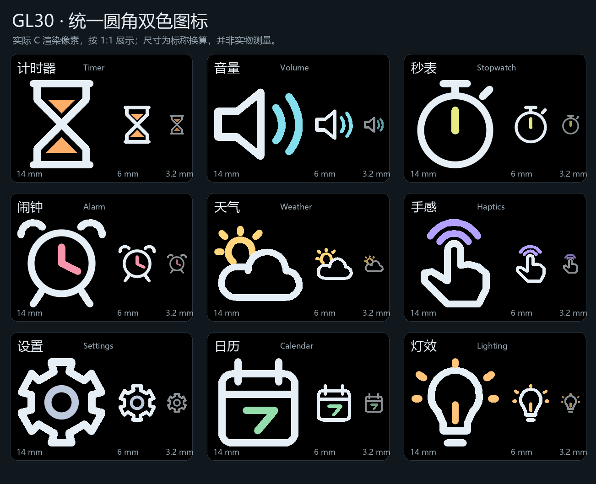
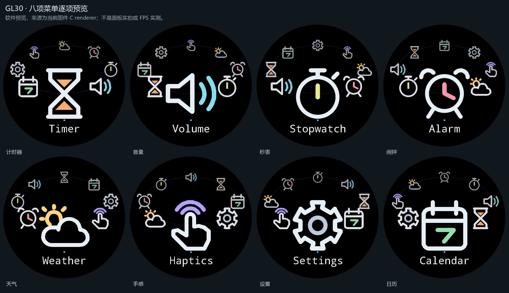
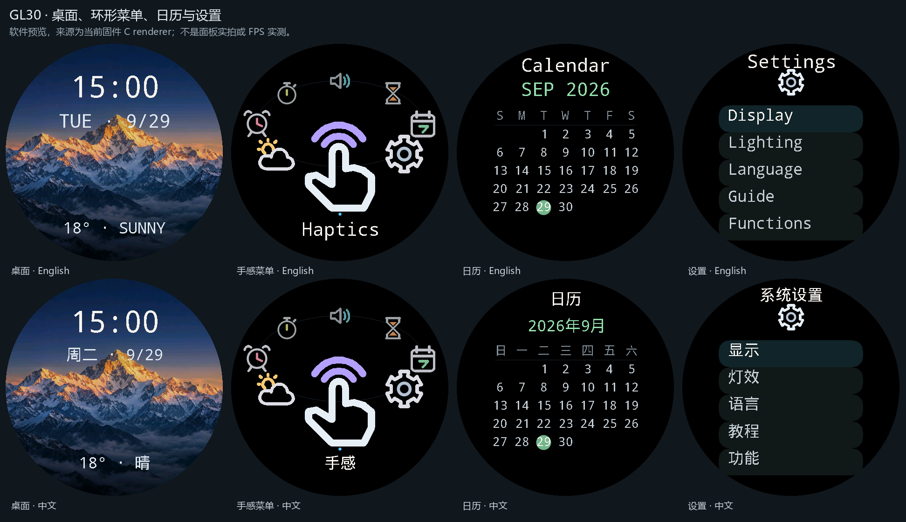

# GL30 图标统一改版 — 2026-09-29

本次替换 `59d4583` 中的旧图标，继续在 PR #7 的独立分支上修改。
预览由实际 C renderer 导出，不是另外绘制的网页界面或效果图。

## 图标语言

九种图标统一使用浅色圆角轮廓和一种功能强调色，去掉深色粗边、多层彩色圆盘、
肤色胶囊和椭圆聚光底座。轮廓采用同一个 24 单位设计坐标系与 1.7 单位线宽；
按每种图标的真实外接尺寸和中心归一化，前景、侧面、后排复用同一组路径。
后排仍保留较亮的轮廓，不因深度增加而切换形状或丢弃重要细节。

| 功能 | 新轮廓 |
| --- | --- |
| 计时器 | 沙漏与少量彩色沙粒，避免与秒表混淆 |
| 音量 | 标准扬声器与两道声波 |
| 秒表 | 圆表盘、顶部按钮、侧键和单根秒针 |
| 闹钟 | 双铃、双脚及两根指针 |
| 天气 | 太阳与一条完整的云轮廓 |
| 手感 | 有拇指、食指和手掌的手形，上方两道反馈波纹 |
| 设置 | 有齿根凹槽的六齿轮，替换花瓣状圆点 |
| 日历 | 双装订扣、分隔线和大日期标记 |
| 灯效 | 灯泡、灯座与短光芒；仍位于设置中，不加入主菜单 |

主菜单仍为八项；桌面不恢复天气图标。保留原来的标称 14 / 6 / 至少 3 mm
尺寸层次。前半圈向两侧适度展开，侧面与后排不整体外移，减少相邻粗轮廓的
粘连，同时保持圆屏边缘安全。尺寸换算不是实物量具校准。

## 绘制及测试

实现位于 `firmware-esp32/components/gl30_ui/src/gl30_render.c` 的
`app_icon()`、`icon_segment()`、`icon_curve()` 和 `icon_box()`。
实心扫描线、多边形弧带和圆端点复用现有 OLED 接口，不新增运行时内存分配。
粗弧用相接的环形多边形条带填充，避免叠加单像素圆弧产生对角线孔洞；
完整圆环仍使用原来的快速扫描线实现。

`round_layout_tests.c` 保留原来的文字和前后景轮廓比较，并增加三档图标外接
尺寸/居中、粗弧内部像素完整性和整圈 64 个位置的圆屏越界检查。
原有三缓冲所有权、发送完成唤醒、输入和协议回归继续执行。
GitHub CI 覆盖 Debug、ASan/UBSan、Release+LTO 及两种 ESP-IDF 固件配置。
具体结果以当前提交的 PR checks 为准，不将以前提交的绿灯当作本次结果。

本次不修改 `app_main.c`、KK_UI、KK_OLED、板级 DMA 驱动、STM32 台架、
H25 验证文件与既有证据；不刷写硬件，也不声称已重新测量实机 FPS。

## 可复现预览

```sh
cmake -S firmware-esp32/ui/kk-preview -B build/icons -DCMAKE_BUILD_TYPE=Debug
cmake --build build/icons --parallel 2
ctest --test-dir build/icons --output-on-failure
mkdir -p build/icon-frames
build/icons/gl30_capture_icons build/icon-frames
python firmware-esp32/tools/make_icon_review.py \
  --frames build/icon-frames --output build/icon-review \
  --font /path/to/local-cjk-font.ttc
```

最后一步使用 Pillow 拼接已导出的像素；仅标题使用调用者提供的本机中文字体，
不复制字体文件。Windows 多配置构建需指定 `--config Debug`，并运行该配置
目录中的 `.exe`。主机预览不能代替 ESP32-S3 的性能测量。






