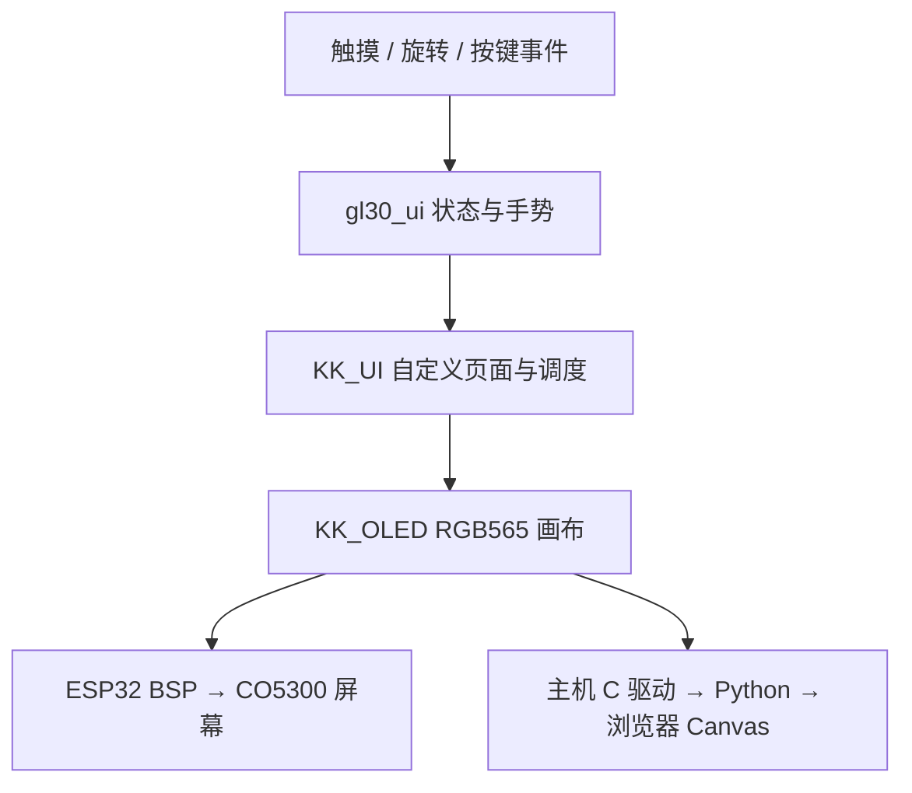

# GL30 KK_OLED / KK_UI 接入与验证记录

交付批次：2026-09-14。目标板为 Waveshare ESP32-S3-Touch-AMOLED-1.32。本次完成六个项目级 Skills、466×466 彩色屏幕固件及共用 C 代码的浏览器预览；用户明确“尚未连接，先完成固件和预览”，未烧录、未进行实屏或电机测试。

## 直接使用

- 当前预览：[本机 8770](http://127.0.0.1:8770)，运行方式见 [README](../firmware-esp32/ui/kk-preview/README_CN.md)。
- [固件交付目录](../outputs/esp32-kk-20260914/) 内有应用、bootloader、分区表、构建日志、校验记录、界面截图和许可证。
- [ESP-IDF 构建脚本](../firmware-esp32/bsp/build-firmware.ps1) 默认只构建，不烧录：

```powershell
powershell.exe -NoProfile -ExecutionPolicy Bypass -File G:\Agent\GL30-Haptic-Control\firmware-esp32\bsp\build-firmware.ps1
```

本机使用 `G:\Agent\.tools\esp-idf-v5.5.1` 和 `G:\Agent\.tools\esp-idf-tools`；可用脚本参数指定另一套已安装的 SDK/工具路径。SDK 为 v5.5.1，commit `fcae32885b0296b32044cb99ecbdc50d98dddb83`，Xtensa GCC 14.2.0。依赖版本和哈希锁定于 [dependencies.lock](../firmware-esp32/dependencies.lock)。

## Skills 和图形库的接入方式

六个 Skills 放在工程根目录 `.agents/skills/`，不覆盖用户全局 Skills：`kk-oled-port`、`kk-oled-use`、`kk-oled-font`、`kk-ui-port`、`kk-ui-use`、`kk-ui-extend`。49 个文件完整保留，清单与 SHA-256 在 `KK_UPSTREAM_MANIFEST.json`。

| 来源 | 固定版本 | 处理 |
| --- | --- | --- |
| [KK_OLED](https://gitee.com/keysking/kk_oled) | `f01831d63b1d426b629921edaba644732aa29223` | Skills 原样复制；图形运行时做 RGB565 适配 |
| [KK_UI](https://gitee.com/keysking/kk_ui) | `582c3442ecbc539c1c82a342676b5b2eda69eee0` | Skills 原样复制；画布改 466×466，使用自定义页面 |

上游 KK_OLED 原本是单色页式显存。本项目保留它的图元、UTF-8/u8g2 字体解码、位图及裁剪/旋转机制，将核心换成 RGB565；新增彩色位图和像素混合，修正大半径椭圆的整数溢出。不能把这个分支描述为上游原生支持彩屏。KK_UI 继续负责输入分发、帧调度、清屏、提交与错误状态，应用在自定义页面回调中绘制表盘和圆环菜单。



浏览器只传输入并解码 C 渲染器产生的 RGB565 帧，没有第二份 JavaScript 业务模型。外壳与扩散灯带是浏览器产品示意，中心 466×466 画面才是实际固件画布；旧 LVGL 和 SVG 演示留作历史来源，不参与本构建，也不是兼容层。

## 本版功能

| 功能 | 已实现的行为 | 边界 |
| --- | --- | --- |
| 山景表盘 | 日照金山背景，小时/分钟/秒、日期 | 北京 UTC+8；板端待 USB 校时；天气明确为示例 |
| 环形菜单 | 9 项双向循环，前大后小，黑色背景；菜单只有一颗蓝色指针 LED 目标 | 灯带尚未接线 |
| 按压交互 | 单击确认、双击后退，20 ms 消抖、300 ms 双击窗口 | 单击延迟判定；长按 650 ms 保留，不误发单击 |
| 计时器 | HH:MM:SS；一格 1 分钟、一圈 60 分钟、最多 6 小时；运行中双向调时；后台继续；角度随倒计时回退 | 计算旋钮角度目标，尚未驱动电机自动转动 |
| 进度与零点 | 多小时圈分色，逐步增长，蓝色最前沿；零点继续反转产生止挡意图 | 不是电机已出力的证据 |
| 音量 | 百分比与弧长/指针角一致；点击静音、旋转取消静音；0/100 边界 | 尚未控制音频或 PC 实际音量 |
| 秒表 | HH:MM:SS.xx，开始/暂停、后台运行、重置 | 无实机时间精度测量 |
| 灯效 | 4 种效果、6 种颜色、0–100% 亮度；转动选字段、单击编辑/保存 | 24 RGB 目标输出；仅本次运行保存，不写 NVS |
| 设置与日历 | 10–100% 屏幕亮度、当前日期 | 亮度映射待实屏检查 |
| 闹钟、手感 | 有独立入口和明确的“待接入”页面 | 未伪装为已工作的闹钟/触觉控制 |

到时会进入完成页；先前尚未确认的短按不会意外清除完成状态。双击在窗口边缘到来时也不会先执行单击。熄屏期间计时继续，第一次短按/双击只唤醒。

圆屏支持边缘沿圆周拖动，中心支持横向拖动。板端当前输入来自触摸；旋钮与侧键事件入口为 `gl30_demo_rotate`、`gl30_demo_button`、`gl30_demo_shortcut`。没有把电机端角度变化自动视作用户主动旋转。

## 板级依据与显存

[Waveshare 官方资料](https://docs.waveshare.com/ESP32-S3-Touch-AMOLED-1.32) 明确该板为 8 MB Flash、8 MB PSRAM、CO5300 显示控制器和 CST820 触摸控制器。引脚及初始化参考 [官方 BSP 固定版本](https://github.com/waveshareteam/Waveshare-ESP32-components/tree/d081959d3841e0b370c2957c122bf8604ab42bc8/bsp/esp32_s3_touch_amoled_1_32)，commit `d081959d3841e0b370c2957c122bf8604ab42bc8`。

| 信号 | ESP32 GPIO |
| --- | --- |
| CO5300 QSPI CS / CLK | 10 / 11 |
| QSPI D0 / D1 / D2 / D3 | 12 / 13 / 14 / 15 |
| 屏幕 RESET | 8 |
| CST820 I2C SDA / SCL | 47 / 48 |
| 触摸 RESET / INT | 7 / 6 |

屏幕设置 x 偏移 6、y 偏移 0。两份静态 RGB565 帧共 `868,624` 字节，链接 map 中确认放入 `.ext_ram.bss`；PSRAM 配置为 Octal 80 MHz。图像和字库放 Flash。板级另用 14,912 字节的 16 行 DMA 缓冲，将 RGB565 转为高字节先发送。

当前公开刷新接口是阻塞式：每段提交后等待真实传输完成，全部完成才返回。IT/DMA 公共入口返回 `OLED_UNSUPPORTED`，没有用阻塞调用冒充异步。底层若提交出错或 500 ms 内未完成，锁存显示故障，拒绝复用可能仍被 DMA 读取的缓冲，也拒绝后续亮度/开关命令。恢复需要重启。触摸总线读取失败取消手势，不伪造一次松开/点击。

UI 调度周期设为 33 ms，但尚未测量实屏帧率、输入延迟、撕裂、触摸方向或颜色顺序。不能用电脑预览帧率作为 ESP32 性能结论。

## 时钟与后续硬件接口

板端启动显示“待校时”。USB Serial/JTAG 控制台支持 `TIME <真实 Unix 秒>`，范围为 2000–2100 年；时区偏移只由显示层添加，不要先给时间戳加 8 小时。可在电脑 PowerShell 取值：

```powershell
'TIME ' + [DateTimeOffset]::UtcNow.ToUnixTimeSeconds()
```

将该行通过连接后的 USB 控制台发送即可。没有 RTC/NTP 校时、断电保存或后台天气网络请求。

USB 承担控制台与日志，UART 控制台已关闭。已有 `transport` 的 V1 二进制协议代码仍保留，尚未接入本次独立屏幕固件；STM32 的电流环与触觉闭环未改。后续 UART、物理按压、RGB 灯带、音频需要按已购买器件和冻结接线联调；本轮没有猜测 LED GPIO、改变电流/故障保护或修改机械件。

## 验证结果与复现

| 验证 | 结果 | 证据 |
| --- | --- | --- |
| ESP-IDF v5.5.1 | 全量构建成功；主线程从 `G:\Agent` 独立重跑退出 0 | `build-idf/build-firmware.log`、`root-verification.log` |
| 目标产物 | 应用 797,312 B；bootloader 20,896 B；分区表 3,072 B | `.bin`、`flasher_args.json`、交付 SHA-256 清单 |
| Windows MSVC | 2/2 测试通过；模型/手势 62 项，RGB565/共享 UI 79 项 | `ui/kk-preview/build-host.log`，CTest 输出 |
| GCC ASan + UBSan | 同样两组测试通过，包括半径 233 椭圆及双击边界 | `ui/kk-preview/build-sanitized.log` |
| 浏览器交互 | 41 项通过 | `ui/kk-preview/browser-checks.json`、`verify-browser.js` |
| Skills / 字库 | 6 Skills、49 文件一致；112 个实际中文字符覆盖通过 | `tools/verify_kk_assets.py` |
| 实屏与机械振动 | 未执行 | 用户本轮确认未连接硬件 |

浏览器验证包含菜单正反向跨圈、菜单单灯、90 分钟显示、运行中调时、后台/熄屏计时、零点反转、音量弧长、秒表、灯效字段以及工具页面。它不是对 BSP DMA、USB 指令、真实 LED/音频的硬件测试。

Spark 原生代理在本会话不受支持，只做了一次只读可用性尝试；板级执行按项目规则由 Luna 接替。主线程编写回归测试、核对改动并重跑构建；RGB565 核心另经独立代码审查。DeepSeek 的皮带分析已完成并读取，结论见 [同步带振动复核](belt-vibration-review-20260914-cn.md)。

## 资源与许可

KK 两个组件保留 MIT 许可证。中文使用 LEDFont 服务生成的文泉驿等宽微米黑子集；来源、字形与尺寸记入 `assets/font-generation.json`，字体 Apache-2.0 许可和版权记录随附。山景沿用工程此前的 `summit-dawn.png`，只转换为 RGB565。详见 [第三方声明](../THIRD_PARTY_NOTICES.md)。

下一步是接屏检查启动、触摸、边界与色序，然后再接 STM32 事件/状态、灯带和声音。同步带可能使短脉冲变软、延迟或出现共振，需要输出端测试；本次只确认软件画面与意图，不确认真实手感。
