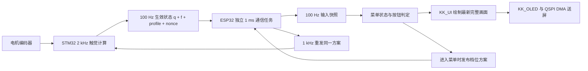

# ESP32 循环菜单、KK_UI 复用与性能优化

日期：2026-09-15。目标屏：Waveshare ESP32-S3-Touch-AMOLED-1.32，466×466 RGB565。

2026-10-02 当前实现补充：以下 FPS、烧录和“九项/40°”描述为 9/15 历史阶段；当前 C 固件实际菜单为八项、45°档距，灯效通过“设置 → 灯效”进入，已纠正此前无入口的误记。底部新增只读电机状态，FAST 接收年龄达到 20 ms 时显示失联，不等于清故障或授权；见[最新画面与验证](../outputs/esp32-motor-feedback-20261002/README_CN.md)。当前未授权但 READY/ACTIVE 链路健康时会发零限值心跳，STM 将其定义为撤使能/关桥；反馈失效或 MOTOR OFF 后只恢复零心跳、不自动恢复授权。普通页面切换保留原人工授权，详见[前一阶段链路审查](../outputs/idle-fault-and-link-review-20261002/README_CN.md)。本次没有重测帧率或烧录。

本轮改动已完成主机验证、STM32 产品编译和 ESP32 烧录。菜单连续正反转测试为约 **16 FPS**，最近 128 次完整 UI 更新的 **P95 为 57.465 ms**。原阶段普通菜单交互记录约 245～249 ms。**40 ms / 25 FPS 的目标尚未达到，也没有达到 30 FPS。** 两阶段测试输入不同，不能把上述数字当作严格同负载的加速比。

最终证据集中在 [outputs/esp32-menu-optimization-20260915](../outputs/esp32-menu-optimization-20260915/)。浏览器预览为 [本机同源预览](http://127.0.0.1:8770/?v=menu-optimized-20260915)，使用与屏幕相同的 C 模型和绘制代码；电脑上的预览速度不代表 ESP32 帧率。

## 采用了哪些 KK_UI 思想

1. **静态页面、静态状态。** 保留一个 Custom 页面及应用状态机，没有增加动态控件树、运行时堆分配或第二份 JavaScript 模型。日照金山表盘、九项环形菜单、前大后小的透视关系和原有按键语义保持。
2. **动画根据时间求当前位置。** 软件旋转输入使用库原有 65 点 Q12 缓动表，200 ms 完成插值。新增公共声明复用已有 `KK_UI_EaseQ12`、`KK_UI_LerpQ12` 实现，没有重写一套缓动曲线。应用目标用整数、插值坐标用 Q8，删除该菜单原有 double 累积位置和 `expf` 追赶。
3. **输入、状态、绘图、提交分工。** 100 Hz 输入采样保存当时的电机状态和按键；按时间顺序处理状态，绘图只呈现最新结果。KK_UI 仍负责清屏和统一提交，不积压动画帧。
4. **先优化热点，保留可验证的契约。** 背景与字体跨度批量写入；曲线光栅使用局部 Q4 坐标、32 位距离计算、逐行跨度及预计算倒数，减少候选像素中的开方、除法和软件 64 位浮点转换。图片内容没有缩小或替换。

真实电机位置不套 200 ms 缓动，避免手已经转过一格、屏幕仍在追赶。动画控制“如何画”，STM32 决定“当前是哪一格”。

## 电机如何控制循环菜单

- 九项菜单，设计传动比仍为 1:1；一项 40°，一圈九项，可双向循环。菜单命令只打开 DETENT，关闭端点止挡与位置伺服，目标原点只在进入时锚定一次。
- 初始参数：档位强度 0.020 N·m、阻尼 0.001 N·m/(rad/s)、合成力矩上限 0.030 N·m。这是待实物调节的保守起点，不是已经确认的最终手感。
- `q` 是 STM32 的 int32 档位编号；`f` 是同一次 2 kHz 计算得到的档内偏移。菜单索引用整数对 9 取余，视觉相位用“取余后的编号 + f”，不会先把巨大整数转换成 float 再取余。选择项仍以 q 为准，保留 STM32 已有的跨档滞回。
- 新增 V1 帧类型 `0x06 HAPTIC_STATE`：36 字节负载、60 字节总帧，包含 profile、命令 nonce、实际模式、q、f、档距、启动状态、故障及有效位。C 与 TypeScript 同步更新，详见 [协议定义](../protocol/schema/protocol-v1.md)。FAST 保持原有 68 字节负载，命令保持 64 字节负载。
- STM32 在 2 kHz 触觉计算后记录测量时间；100 Hz 状态发送直接读取已缓存的 q/f，不用更新更快的观察器角度重新计算 f。发送过程不等待串口，slow/haptic 待发标志轮换，最大 60 字节新帧在原有 128 字节 TX 缓冲内。
- GPIO43 / J1-11 是 ESP TX，接 STM PB11 RX；GPIO44 / J1-12 是 ESP RX，接 STM PB10 TX；5 Mbaud、8N1、共地、3.3 V 信号。扩展口的两侧 3.3 V 电源不能互相回灌。USB 承担文本日志，UART0 只传二进制协议。

### 生效确认与失效处理

上电保持未使能，ESP32 不发送任何电机命令。新增 `MOTOR ARM` / `MOTOR OFF` 是以后受控联调用的 USB 调试命令，本轮没有发送 `MOTOR ARM`。

收到编码器就绪、无故障且处于 READY/ACTIVE 的新鲜 FAST 状态后，才能维持会话。只有 profile、nonce、DETENT 模式、40° 档距及有效位均匹配的 HAPTIC_STATE 才进入菜单；FAST 或 HAPTIC 接收年龄须小于 20 ms。第一次生效确认最多等待 100 ms，确认后的反馈失配或失联立即使会话锁止，恢复通信不会自动重新使能。

停力包保留到 UART 实际接受全部字节，发送忙不会丢掉唯一的一次零力矩请求。界面发布停止 500 ms 后也锁止会话；这一期限允许正常绘图耗时，与 STM32 的 20 ms 通信保护是不同条件。显示提交失败同样取消使能。STM32 原有电流、启动、通信与故障保护保留。

**范围说明：** 此次完成的是菜单的端到端软件链路；计时器回旋、音量端点、振动纹理等功能没有在本次自动测试中驱动实体电机。STM32 的基础多圈角度观察器仍沿用原实现，不能据此声称长期无限圈计数精度已得到验证。

## 绘制和内存改动

| 层 | 改动 | 保留的行为 |
|---|---|---|
| 应用光栅 | Q4/32 位计算；满环扫描线；部分圆弧递推 | 466×466、原布局、颜色与透明边缘；不是减少菜单项 |
| KK_OLED | H/V 跨度、RLE 连续段批量写入 | 全部旋转、裁剪、SET/CLEAR/XOR、字体背景语义 |
| 清屏 | 记录缓冲是否已是同色，跳过同色的重复整帧写入 | 调用方照常 Clear；改变背景或任何绘图写入都会使记录失效 |
| BSP | 两条 16 行 DMA 暂存区，转换下一条时发送当前条 | 返回前等待最后一条完成；超时后不复用未确认完成的内存 |
| 缓存 | 指令 16→32 KiB，数据 32→64 KiB、64 字节缓存行 | CPU 240 MHz、PSRAM 80 MHz、面板 QSPI 40 MHz，未超频 |
| 主任务栈 | 3584→5120 字节 | 由实测约 0.5 KiB 剩余提高到约 2 KiB，保留检查能力 |

第二条 DMA 暂存区增加 14,912 字节，缓存额外占用 48 KiB 内部 RAM，主任务栈增加 1,536 字节。没有增加完整帧缓存或字形图片缓存；KK_OLED 仍使用原来的两块 434,312 字节 PSRAM 画布。性能诊断使用静态 128 样本窗口。

重复清屏优化仍执行原来的清屏调用；新缓冲若已是正确背景色，物理上不再重写一次。异步 Busy、缓冲冻结/交换、失败重试与休眠恢复稳定帧都保留，并继续测试。尝试过的逐 4 字节 memcpy 转换在实板变慢，最终版已移除。

优化方法参考 [Espressif 5.5.1 性能指南](https://docs.espressif.com/projects/esp-idf/en/v5.5.1/esp32s3/api-guides/performance/speed.html)，硬件测量结果以本项目日志为准。

## 验证结果

| 验证 | 结果与证据 |
|---|---|
| Windows 原生 C | 3/3 通过：模型/手势、RGB565/实际 UI、STM 触觉→编码→ESP 会话→菜单 |
| ASan + UBSan + 警告视为错误 | WSL GCC 3/3 通过；初次发现测试仍对整数位置调用 fabs，按整数边界断言修正 |
| KK_OLED 等价性 | 288 组旋转/字体方向/绘图模式/背景组合，完整帧逐字节一致；另测重复 Clear 和异步失败恢复 |
| 视觉对照 | 19 个实际 C 画面检查，[前后对照图](../outputs/esp32-menu-optimization-20260915/visual-comparison.png)；新光栅的边缘像素允许改变，不声称与旧光栅逐字节一致 |
| TypeScript 协议 | 类型检查及 22 项测试通过；新增 36 字节小端向量和 60 字节帧检查 |
| STM32 | Keil ARMCLANG 产品构建 0 Error / 0 Warning；现有主机测试 7/7 通过；**未烧录 STM32** |
| ESP32 | ESP-IDF 5.5.1 构建通过；COM11、设备 AC:27:6E:D2:F6:5C，应用写入 0x10000，esptool 校验哈希通过 |
| USB 功能 | 最终 20 项软件交互检查通过：循环、单/双击、音量零点、运行中改计时、秒表、灯效等 |
| 连续菜单性能 | USB 每 80 ms 发送一格正/反转，持续 18 s，预热后 61 个状态样本；实测面板更新约 16.01 FPS |

最终连续测试：完整 UI 更新采样 P50 **56.586 ms**、采样 P95 **56.929 ms**、固件最近 128 次 P95 **57.465 ms**；末次绘制 **19.096 ms**、整帧送屏 **25.506 ms**。它们包含不同的计时范围，不应把 draw_us 单独称为整机帧耗时。

内部 RAM 剩余 **250,003 字节**，主任务最低栈余量 **2,076 字节**；电机任务观测最大调度间隔 **1,026 µs**。`frame_errors=0`、`touch_errors=0`、`input_queue_drops=0`、`motor_tx=0`。这是未连接真实 STM32 数据流时的 ESP32 调度测量，不代表满 UART 流量或电机运行时的最坏时序。

独立审查记录：DeepSeek 首次 32K 调用在推理阶段耗尽预算，未产出结论；一次简短补审已完成，但把 ESP 会话超时误认为 STM 的 nonce 超时，相关论证没有采纳。最终修复按实际代码与可复现测试验收。Spark 原生通道本会话不可用，主线程完成新增测试和最终验证，Luna 完成明确分工的生产代码修改。

## 交付与真实边界

- [本轮冻结的 ESP32 应用镜像](../outputs/esp32-menu-optimization-20260915/gl30_menu_20260915.bin)，最终 815,856 字节；SHA-256 为 `2d72bb69270f947c36300cd8b3059652895e5838da0cc716ae1c957a1a6fb175`，来源及日志索引见 [manifest.json](../outputs/esp32-menu-optimization-20260915/manifest.json)。
- [完整 USB 功能证据](../outputs/esp32-menu-optimization-20260915/usb-smoke-final.json)；[连续菜单性能证据](../outputs/esp32-menu-optimization-20260915/menu-benchmark-final.json)。
- [复跑连续菜单测试脚本](../firmware-esp32/tools/usb_menu_benchmark.py)，只发送 UI 软件输入，开始时需处于表盘。
- Type-C 校时已恢复；本次再次校时回读误差 0 秒，原有后台程序继续运行。
- 没有改机械、外壳、BOM 或电流环算法；没有访问 ST-LINK COM4、烧写 STM32 或运行电机。
- 尚未验收：实屏目视、实体触摸/按钮、真实 STM32 UART 联调、皮带下的档位/振动手感，以及目标 40 ms / 25 FPS。当前剩余耗时主要是完整彩色画面的绘制、PSRAM 访问与送屏，不能归因于 KK_UI 缓动表本身。
