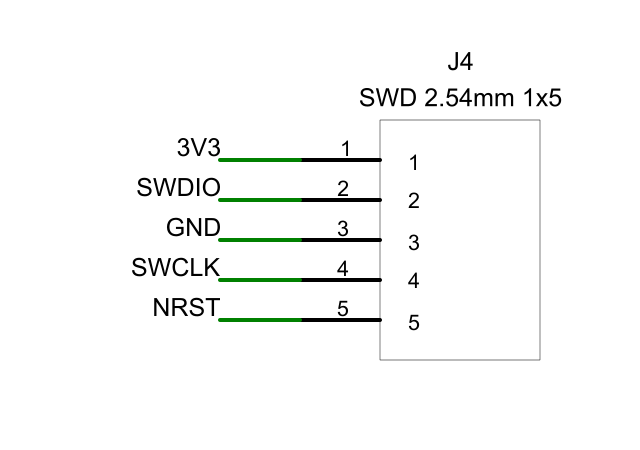

# GL30 A 板 AD 原理图：无测试点

## 公开快照范围（2026-10-03）

本目录公开七页 R6 原生原理图、BOM、库匹配说明和原验证记录。**不附送五份个人/派生封装库**，也没有 PCB 布局、走线或制造文件。公开副本的 `.PrjPcb` 文档列表仅保留七页；符号中的封装关联参数保留。

下面的 142/146 封装关联及 AD 检查结果，来自本机完整库环境的 2026-09-27 记录，不能作为本公开包可独立复现封装导入的结论。验证脚本是本地完整工程的工具，依赖用户库及对应工具环境。

在你的电脑继续编辑时，使用原本 `hardware/pcb/stm32-foc-a-altium-r6` 完整工程；该原工程和五份库没有因上传而改动。公开快照的库名称/焊盘映射仍可用于重新关联你有权使用的库。下一步见[画板指南](../../../docs/pcb-drawing-guide-20261003-cn.md)。

以下为原本机 R6 工程说明；其中“提供库副本”仅描述本机包，不描述本公开快照。

版本：**A-SCH-AD-R6-USER-LIB-NO-TP**，2026-09-27。

用 Altium Designer 打开 `GL30_A_STM32_FOC_NO_TP.PrjPcb`。工程含 7 页原生可编辑原理图、146 个位号；全部 66 个测试点已删除，**142/146 个位号已关联封装**。本机 AD 26.10.1.5 已读入并完成逐引脚连接比对。

本版接入用户新增库中的 STM32、四个固态电容、复位按钮、两个 FFC 插座和 J7；按用户最新决定，将 J4 改为常见的单排 5P、2.54 mm 直插排针。除 J4 接口规格外，其他 145 个位号的采购料号、数值、封装规格和装配状态保持不变。

## J4 调试口

采购规格：**单排 1×5P、2.54 mm、直插公排针，常见约 0.64 mm 方针**，1 个；也可把长排针剪为 5 针。不限定品牌，无防呆外壳。

| 脚号 | 连接 | 用途 |
| --- | --- | --- |
| 1 | 3V3 / VTREF | 调试器目标电压参考 |
| 2 | SWDIO | SWD 数据 |
| 3 | GND | 共地 |
| 4 | SWCLK | SWD 时钟 |
| 5 | NRST | 目标复位 |

**按脚号接线，1 脚是方形焊盘。VTREF 接调试器的目标电压检测端，不接调试器的 5 V 或电源输出端。** 此单排接口为本板自定义排列，不按旧版 2×5 Cortex 插座的物理位置接线。

J4 沿用用户 `HDR2.54-LI-5P` 几何，在项目派生库中仅将镀通孔由 0.90 mm 放大到 1.02 mm；脚距 2.54 mm、焊盘 1.70 mm、编号和 3D 数据保留。原始用户库不改。[标准方针及推荐孔径参考](https://suddendocs.samtec.com/catalog_english/tsw_th.pdf)

## 工程内容

| 文件 | 内容 |
| --- | --- |
| `GL30_A_STM32_FOC_NO_TP.PrjPcb` | AD 工程入口 |
| `A01_POWER_MCU.SchDoc` | MCU、晶振、复位、BOOT0、3.3 V 电源 |
| `A02_DRV8316.SchDoc` | 驱动、六路 PWM、充电泵及去耦 |
| `A03_CURRENT_ADC.SchDoc` | 电流/母线采样、模拟开关隔离 |
| `A04_HARD_PROTECT.SchDoc` | 独立过流/过压保护 |
| `A05_ENCODER_NTC.SchDoc` | 编码器及温度探头接口 |
| `A06_LINKS_POWER.SchDoc` | FFC、五针 SWD、UART 电源域及故障信号 |
| `A07_BUS_CONTROL.SchDoc` | 母线、相线、控制默认值及驱动 SPI |
| `BOM_no_testpoints.csv` | 146 个位号，含不装配项和库来源 |
| `User_*.PcbLib` | 三份用户库副本，与原文件逐字节一致 |
| `GL30_Adjusted_User.PcbLib` | J7 派生封装：0.85 mm 孔、1.40 mm 焊盘 |
| `GL30_J4_Header.PcbLib` | J4 派生封装：1.02 mm 孔、1.70 mm 焊盘 |
| `USER_LIBRARY_CN.md` | 补库核对及剩余事项 |
| `verification/` | 实际 AD 回执、连接比对及尺寸检查记录 |

五份封装库均通过工程相对路径关联。原理图符号、引脚、导线及标签已内嵌。BOM 的 `Source_KiCad_Footprint` 仅记录历史来源，真实 AD 关联见 `Altium_PCB_Model` 和 `Altium_PCB_Library`。

工程使用 **Global 网络作用域**，跨页同名标签相连，请保留该设置。删除测试点后，U1 的 PC14/3 脚、PC15/4 脚、PA11/33 脚明确未连接；ADC 仍通过 MCU 内部 TIM1 TRGO2/OC4 触发。J4 的 R6 接口变更已独立纳入核对，历史 KiCad 源稿保留。

## 实际验证及边界

- 原生文件回读、真实导线/标签重建及 AD 实际提取均一致：7 页、146 位号、456 个物理引脚，其中 447 个连接、9 个明确未连接、98 个网络、0 测试点。
- AD 识别全部 142 个已关联位号，包括 J4/J7 派生封装；引脚编号与对应焊盘一致。
- AD 报告 **0 错误、34 条警告**：4 个板上自定义焊盘缺少封装、30 个无驱动源提示。检查规则保留，没有用批量 No ERC 消除警告。
- `DM_Compile` 返回 0。本轮连接提取与逐引脚比对通过，不能称为所有编译检查通过或投板放行。
- J4 以外的原生对象保持一致，封装关联不改变图面；修改后的 J4 图面已查看。原始用户库和上一版已打开的工程未覆盖。

剩余 J1/J2/J3 是直焊接口，JP1 是焊桥：在 PCB 阶段按线径、板形和空间设计，不需要再找采购连接器。J1/J2/J3 虽标不装配，**板上的焊盘仍需保留**；C53/C54 仍为可选不装配电容。

布局前仍需核对实物 FFC 接触方向、厂家编码器板本地 10 µF 电容及 30 条驱动源提示。整板散热、间距和装配工艺待布局阶段核定。按约定，原理图审核后**只布局、不布线**；本次没有 `.PcbDoc`、没有硬件上电验证。

符号来源及许可见 `THIRD_PARTY.md`、`KICAD_LIBRARY_LICENSE.md`。人工编辑后不要重跑生成脚本覆盖。
